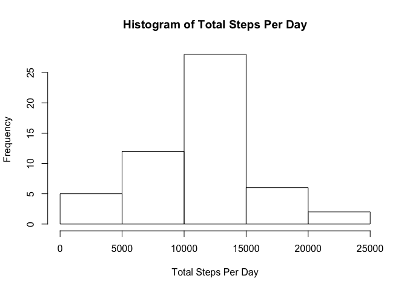
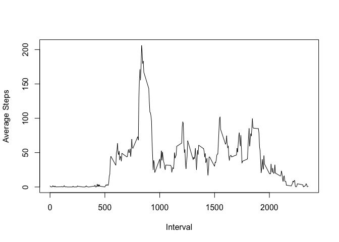
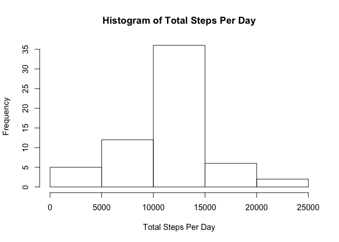
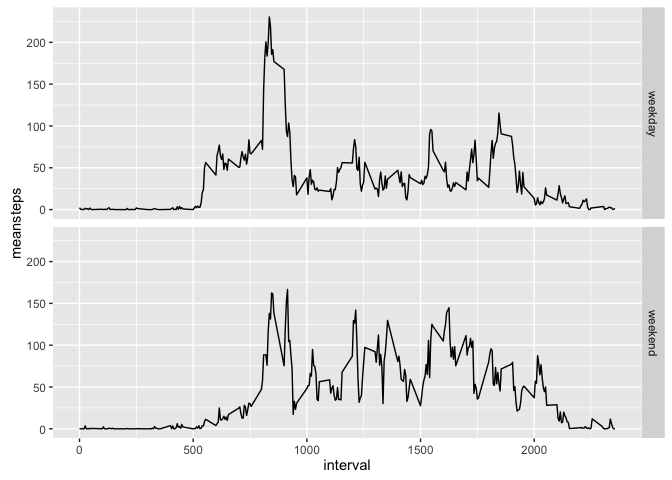

# Reproducible Research: Peer Assessment 1


## Loading and preprocessing the data

```r
data <- read.csv(unz("activity.zip", "activity.csv"), header=TRUE, sep=",",  quote="\"", na.strings="NA")
data$date <- as.Date(data$date, format="%Y-%m-%d")
```

## What is mean total number of steps taken per day?
* Calculate the total number of steps taken per day

```r
total <- aggregate(data$steps, by=list(data$date), FUN=sum)
names(total) <- c("date", "totalsteps")
```
* Make a histogram of the total number of steps taken each day

```r
hist(total$totalsteps, xlab="Total Steps Per Day", main="Histogram of Total Steps Per Day")
```



* Calculate and report the mean and median of the total number of steps taken per day

```r
stepsmean <- mean(total$totalsteps, na.rm=TRUE)
stepsmedian <- median(total$totalsteps, na.rm=TRUE)
```
+ Mean: 1.0766189\times 10^{4}
+ Median: 10765

## What is the average daily activity pattern?
* Make a time series plot (i.e. 𝚝𝚢𝚙𝚎 = "𝚕") of the 5-minute interval (x-axis) and the average number of steps taken, averaged across all days (y-axis)

```r
daily <- aggregate(data$steps, by=list(data$interval), FUN=mean, na.rm=TRUE)
names(daily) <- c("interval", "meansteps")
plot(y=daily$meansteps, x=daily$interval, type="l", xlab="Interval", ylab="Average Steps")
```



* Which 5-minute interval, on average across all the days in the dataset, contains the maximum number of steps

```r
maxrow <- daily[daily$meansteps == max(daily$meansteps), ]
interval <- maxrow$interval
```
+ Interval: 835

## Imputing missing values
* Calculate and report the total number of missing values in the dataset (i.e. the total number of rows with 𝙽𝙰s)

```r
totalmissing <- sum(is.na(data$steps))
```
+ Total Rows Missing: 2304

* Devise a strategy for filling in all of the missing values in the dataset. The strategy does not need to be sophisticated. For example, you could use the mean/median for that day, or the mean for that 5-minute interval, etc.
+ The average for each interval will be used to replace missing step values for intervals.
* Create a new dataset that is equal to the original dataset but with the missing data filled in.

```r
completeData <- data
for (i in 1:nrow(completeData)){
  if ( is.na(completeData[i, "steps"])) {
    completeData[i, ]$steps <- daily[daily$interval == completeData[i,]$interval,]$meansteps
  }
}
```

* Make a histogram of the total number of steps taken each day and Calculate and report the mean and median total number of steps taken per day. Do these values differ from the estimates from the first part of the assignment? What is the impact of imputing missing data on the estimates of the total daily number of steps?

```r
total <- aggregate(completeData$steps, by=list(completeData$date), FUN=sum)
names(total) <- c("date", "totalsteps")
stepsmean <- mean(total$totalsteps, na.rm=TRUE)
stepsmedian <- median(total$totalsteps, na.rm=TRUE)
hist(total$totalsteps, xlab="Total Steps Per Day", main="Histogram of Total Steps Per Day")
```



+ Mean: 1.0766189\times 10^{4}
+ Median: 1.0766189\times 10^{4}
+ The values don't differ to any significant degree.  There doesn't appear to be any real impact on inputting missing data with this particular strategy.

## Are there differences in activity patterns between weekdays and weekends?
* Create a new factor variable in the dataset with two levels – “weekday” and “weekend” indicating whether a given date is a weekday or weekend day.

```r
completeData$daytype <- weekdays(completeData$date)
for(i in 1:nrow(completeData)){
  if ( completeData[i,]$daytype %in% c("Saturday", "Sunday")) {
    completeData[i,]$daytype <- "weekend"
  }
  else {
    completeData[i,]$daytype <- "weekday"
  }
}
completeData$daytype <- factor(completeData$daytype)
```
* Make a panel plot containing a time series plot (i.e. 𝚝𝚢𝚙𝚎 = "𝚕") of the 5-minute interval (x-axis) and the average number of steps taken, averaged across all weekday days or weekend days (y-axis). See the README file in the GitHub repository to see an example of what this plot should look like using simulated data.

```r
daily <- aggregate(completeData$steps, by=list(completeData$interval, completeData$daytype), FUN=mean, na.rm=TRUE)
names(daily) <- c("interval", "daytype", "meansteps")
library(ggplot2, quietly=TRUE)
```

```
## Warning: package 'ggplot2' was built under R version 3.2.4
```

```r
gp <- ggplot(daily, mapping=aes(x=interval, y=meansteps)) + geom_line() + facet_grid(daytype ~ .)
gp
```


